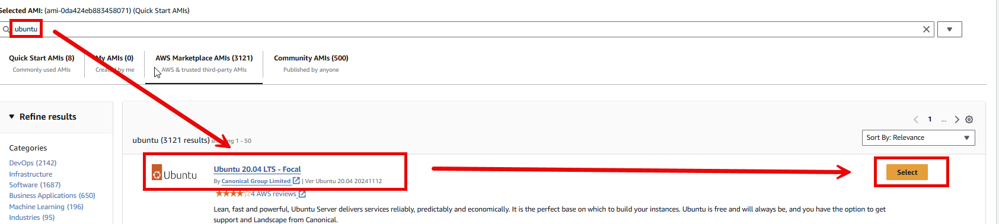
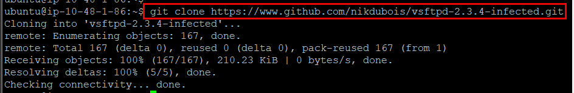
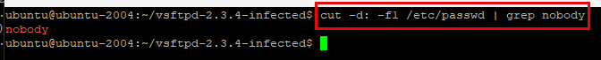

# AWS Penetration Testing with Kali Linux
This repository will help you set up vulnerable-by-design environments in the cloud to minimize the risk involved while learning all about cloud pentration testing and ethical hacking. It will be a step-by-step guide for setting up test environments within AWS, performing reconnaissance to identify vulnerable services using a variety of tools, finding misconfigurations and insecure configurations for various components, and how vulnerabilities can be used to gain further access.

This is part of a school project, it's aimed at security analyst or a penetration tester who are interested in exploiting cloud environments to establish vulnerable areas and then secure them.

We will use gen AI tools, like ChatGPT, to accelerate the preparation of IaC templates and configurations.

### Why should we build a penetration testing lab in the cloud?
As a security professional, building pentesting labs can help us practice our skils safely in an isolated environment.

## Setting up a Pentesting Lab on AWS
This section focuses on setting up a vulnerable Linux virtual machine (VM) as well as a Windows VM on AWS and putting it on the same network as the Kali instance.

Aimed at helping penetration testers who don't have direct access to targets for penetration testing set up a vulnerable lab environment within AWS. This lab will allow testers to practice various exploitation techniques using Metasploit and rudimentary scanning and vulnerability assessment using multiple tools within Kali.

Will setup a vulnerable Linux VM and a generic Windows VM on AWS, on the same network.

Technical requirements:
- **Damn Vulnerable Web Application**
- **Very Secure File Transfer Protocol Daemon (vsftpd)** version 2.3.4

### Setting up a vulnerable Ubuntu EC2 instance
#### Provisioning an Ubuntu EC2 instance
The vulnerable instance of Ubuntu will contain a single vulnerable FTP service, as well as some other services.

Let’s provision an Ubuntu instance that will be running a vulnerable operating system, Ubuntu 18.04

1)	Search **EC2** in AWS console


2)	Click **Launch instance** on EC2 dashboard


3)	Start off with giving the instance a Name, then hit **Browse more AMIs** to search for the Ubuntu image


4)	Search for **Ubuntu 20.04 LTS – Focal** image under the **AWS Marketplace AMIs** tab -> Click the **Select** button. You might get a pop-up window that will require you to subscribe to the AMI. Click **Subscribe Now**.



5)	**Instance type** –> Select **t2.micro**. Verify is **free tier eligible** before selecting.


6)	**Key pair (login)** –> select **Create your own key pair**
    - To **Create key pair**, give it a name. Select **RSA** key type, and save it in a **.ppk** format so we can access the server via Putty.


7)	**Network settings**:
    - **VPC**
        - Select **cis4850-vpc1**
    - **Subnet**
        - Since we will allow traffic from the internet, put it under **cis4850-public-subnet**
    - **Auto-assign public IP** -> select **Enable**
    - **Firewall (security groups)** -> **Select existing security group**
        - In the dropdown for **Common security groups**, select the existing SG, **pentest-lab-public-sg**
            - The only rule allows port 22 traffic from the internet


8)	**Configure storage** -> Increase the volume size to **75 GiB**


9)	Keep the default settings in **Advanced Detail**.  All is left is **Launch instance**


After launching the instance, you will be subscribing to the **AMI**, the EC2 build will initiate. You will see a green **Success** banner once it is completed.


Last step, verify the EC2 Ubuntu instance was created by looking at the **Instances** in the **EC2 dashboard**.


#### Putty login
---
1)	Install **PuTTY** on your local machine -> [PuTTY: a free SSH and Telnet client](https://www.chiark.greenend.org.uk/~sgtatham/putty/)

2)	Once installed, launch **Putty**

3)	Go to **Connection -> SSH ->** expand **Auth**, then go to **Connection** and, next to the field named **Private key file for authentication**, click on **Browse**. Point PuTTY to the .ppk file was created


![alt text](assets/img


#### Install a vulnerable service on Ubuntu EC2 instance
---

Once connected, run the following command these commands to update the repository listing and all the packages installed on this Ubuntu instance. Type Y when prompted to continue with the installation.
```
sudo apt-get update && sudo apt-get dist-upgrade
```


On this Ubuntu host, we will install a vulnerable version of an FTP server, vsftpd
-	Version 2.3.4 of this FTP software was found to be backdoored
-	The backdoored version of vsftpd 2.3.4 is archived on GitHub. We shall be using that code to install the vulnerable software. To start with, we need to clone the git repository:

```
git clone https://github.com/nikdubois/vsftpd-2.3.4-infected.git
```



Next, we need to install packages for setting up a primary build environment. To do this, we run the following:
```
sudo apt-get install build-essential
```


Now, we ```cd``` into the **vsftpd** folder to build it from source. But, before doing that, we need to make a small change to the **Makefile** 
```
cd vsftpd-2.3.4-infected/
nano Makefile
```


The ***-lcrypt*** value needs to be added to the link flag:


Once done, save the file and just run:
```
make
```


If all goes well, we should see a **vsftpd** binary in the same folder. Verify by running:
```
ls -lha vsftpd
```


Next, we need to set up some prerequisites before installing **vsftpd**. 

We need to add a user called ***nobody*** and a folder called ***empty***. To do that, run the following commands:
```
useradd nobody
mkdir /usr/share/empty
```


If the user ***nobody*** already exists, verify by running:
```
cut -d: -f1 /etc/passwd | grep nobody
```



Next, verify the folder **empty** was created:
```
ls -l /usr/share | grep empty
```


Once done, we can run the installation by executing the following commands:
```
sudo cp vsftpd /usr/local/sbin/vsftpd
sudo cp vsftpd.8 /usr/local/man/man8
sudo cp vsftpd.conf.5 /usr/local/man/man5
sudo cp vsftpd.conf /etc
```


Once that's done, we need to execute the vsftpd binary to confirm whether we can connect to the localhost:
```
/usr/local/sbin/vsftpd &
ftp localhost
```


Next step is to set up anonymous access to the FTP server. To do this, we need to run the following commands:
```
mkdir /var/ftp/
useradd -d /var/ftp ftp
chown root:root /var/ftp
chmod og-w /var/ftp
```


Lastly, enable **local login** to the vsftpd server by making the following changes to ```vsftpd.conf```. Do this by running:
```
nano /etc/vsftpd.conf
```
Uncomment **local_enable**. It should look like the second picture


### Setting up a vulnerable Windows instance
Here we set up an attack vector through a Windows server that's running a vulnerable web application.

For the purpose of this lab host, we will be using a Server 2003 instance from the AWS Marketplace:


The provisioning steps are pretty much identical to what we used to set up the Linux instance earlier. Care should be taken that the VPC settings are similar to what we used for the previous instance. This will later allow us to configure the VMs to be on the same network.

After verifying the VPC settings and the region, we proceed to launch the instance. We set the key-pair that we have been using all along and we are good to go. Once the instance has been launched, we need to follow a slightly different process to access a Windows instance remotely. Since Remote Desktop Protocol (RDP) doesn't support certificate-based authentication, we need to provide the private key to decrypt and get the password using which we can log in. This is done by simply right-clicking on the instance and selecting Get Windows Password:

We are required to upload the private key that was downloaded earlier. Simply clicking on Decrypt Password will provide us with the password that we can use to RDP into our Windows server instance. 


Now fire up Remote Desktop and connecting to the IP address using the displayed credentials.

Once we are logged in, the next step is to set up XAMPP on the Windows server so we can host a vulnerable website on the server. But before we proceed, we need to install the latest version of Firefox on the server, since the Internet Explorer version that comes packaged with Windows Server 2003 is pretty old and doesn't support some website configurations. 

To download XAMPP, just access https://www.apachefriends.org/download.html and download the version that's built for XP and Windows Server 2003:


Finally, we need to follow the default installation process, and we will be set up with a working installation of PHP, Apache, and MySQL, along with a few necessary utilities that we need to manage a website.


#### Configuring a vulnerable web application on Windows
Here we will be setting up an extremely vulnerable web application for the pentesting lab. To begin with, let's clear up the XAMPP hosting folder by accessing C:\xampp\htdocs.

Create a new folder called _bak and cut and paste all the existing files into that folder. 


Now, let's download the vulnerable website's source code. For this, we will use one of the many vulnerable PHP samples that are available on GitHub: https://github.com/ShinDarth/sql-injection-demo/.

The fastest way to get the files is to directly download the ZIP file:


Once downloaded, it's simply a matter of copying the contents of the ZIP file into the C:\xampp\htdocs folder. If done correctly, this is what the file structure should look like:


Once completed, the next step is to create a database for the application and import the data into it. To achieve this, you need to access the phpMyAdmin interface, which is accessible at http://127.0.0.1/phpmyadmin. Once here, select the New option under Recent. Here we create a new database called sqli:


Next, to import data into the newly created database, we go into the Import tab and browse to the database.sql file that we just extracted into the htdocs folder:


Once we click on Go we will see a success message. Now, if we browse to http://127.0.0.1 in our browser, we will be able to access the vulnerable website:


We now have successfully configured a vulnerable web application on the Windows server! The next step will be to set up the networking rules within our VPC so that the vulnerable hosts are accessible from the other EC2 instances.


### Configuring security groups within the lab
In this section we configure network so that our web application isn't accessible to outsiders and, at the same time, so that the other lab machines can communicate with each other.

We had originally set all of the EC2 instances to be on the same VPC. This is how EC2 instances on the same subnet are able communicate with each other through internal IP addresses. However, AWS doesn't want to allow all 4,096 addresses on the same VPC to be communicating with each other. As a result, the default security groups don't allow communication between EC2 instances.

To allow connectivity from the Ubuntu instance to the Windows instance (you can repeat these steps for the Kali instance that will be set up in the next chapter), the first step is to get the Private IP address of the Ubuntu host:


Next, we need to modify the security group rules for the first Windows instance
Click **Security Group** in the summary pane

Click on the Edit button and add the rule allowing all traffic from the Kali Linux instance:


Once done, just save this configuration. To confirm that Kali can now communicate with the Windows server, let's run a curl command to see if the site is accessible:
```
curl -vL 172.31.26.219
```

Make sure to replace the IP address with your IP address for Windows. If all is well, there should be a bunch of JavaScript in response:


# Setting Up a Kali Pentestbox on the Cloud
Lets now focus on creating an Amazon EC2 instance, setting it up with a Kali Linux Amazon Machine Image (AMI) that is available on the Amazon Marketplace, and configuring remote access to this host through a variety of means.

This means that a penetration tester can quickly set up a Kali Linux instance on the Amazon Cloud and access it at any time for any kind of penetration test.

Here we will focus on creating an Amazon EC2 instance, setting it up with a Kali Linux AMI, and configuring remote access to this host in a variety of ways. Once set up, a penetration tester can remotely access a Virtual Private Cloud (VPC) belonging to an AWS account and perform pentests within that VPC and on any remote hosts using Kali.

Technical requirements:
- AWS EC2 instance
- Kali Linux AMI
- Apache Guacamole (https://guacamole.apache.org)
- SSH client and a browser

## Setting up Kali Linux on AWS EC2
We will utilize the Kali Linux AMI on the AWS store. These act as templates and allow one to quickly set up a new VM on AWS without going through the unnecessary hassle of manually configuring hardware and software like on traditional VMs. However, the most useful feature here is that AMIs allow you to bypass the OS installation process entirely.

We will start by accessing the Kali Linux AMI on the AWS Marketplace:


### Configuring Kali Linux instance
1. Use the same VPC as we did for the other servers in the pentesting lab

2. We set up the Security Group in such a way that unauthorized outsiders would not have access to the instances. However, in this case, we need to allow remote access to our Kali instance. Hence, we need to forward the SSH and the Guacamole remote access port to a new Security Group

3. We can use the same key pair that was created during the setup of the lab environment

4. Setting root and user password
- Change the root password. Run:
    - ```sudo passwd```
- Change the password of the current user. Run:
    - ```sudo passwd ec2-user```

5. Enabling root and password authentication on SSH
- OpenSSH server comes with root login disabled by default. Enabling this is a straightforward process and involves editing a configuration file, /etc/ssh/sshd_config. The critical parts of this are the two entries:
    - **PermitRootLogin**: This can be set to yes if you want to log in as root
    - **PasswordAuthentication**: This needs to be set to yes instead of the default no to log in using passwords.
- Next, restart the ssh service:
    - sudo service ssh restart

Our Kali Machine on the cloud is now up and running and can be accessed over SSH.

### Setting up Guacamole for remote access
Apache Guacamole is a clientless remote access solution that will allow you to access the Kali Linux instance remotely using a browser. The traditional way of accessing such servers is over SSH, but this will not be able to provide a GUI when accessed from a mobile device.

#### Hardening and installing prerequisites
For starters,we install and set up a firewall and IP blacklisting services to protect against brute-forcing attacks and similar attacks on the internet. The services we will install are ufw and fail2ban.

1. Run
    ```sudo apt-get install ufw fail2ban```

2. Once the firewall is installed, we need to allow two port that we will be using for remote access.
- 22 for SSH
    - ```sudo ufw allow 22```
- 55555 for Guacamole
    - ```sudo ufw allow 55555```

3. Restart the **ufw** service:
    - ```sudo service ufw start```


### Configuring Guacamole for SSH and RDP access
4. Next, we need to install the prerequisites for Apache Guacamole. You can do this by executing the following command:
    - ```sudo apt-get install build-essential htop libcairo2-dev libjpeg-dev libpng-dev libossp-uuid-dev tomcat8 freerdp2-dev libpango1.0-dev libssh2-1-dev libtelnet-dev libvncserver-dev libpulse-dev libssl-dev libvorbis-dev```

5. Post-installation, we need to modify the configuration of Apache Tomcat to listen on port 55555 (as set in our Security Group) rather than the default 8080. To do this, we need to run the following command:
    - ```sudo nano /etc/tomcat8/server.xml```
    - Then change the connector port from 8080 to 55555

6. Next we set up the RDP service on Kali. To this by installing xrdp:
    - ```sudo apt install xrdp```

7. Then, allow all users to access the RDP service (the X Session).
    - Edit this file:
        - ```sudo nano /etc/X11/Xwrapper.config```
    - Change the value of **allowed_users** to anybody
        - ```allowed_users=anybody```

8. Lastly, set the xrdp service to start automatically and enable the services
    - ```sudo update-rc.d xrdp enable```
    - ```sudo systemctl enable xrdp-sesman.service```
    - ```sudo service xrdp start```
    - ```sudo service xrdp-sesman start```

9. Download the source code for <a href="https://downloads.apache.org/guacamole/.">Apache Guacamole</a>
    - You need to download the latest guacamole-server.tar.gz and guacamole.war files.
 
    ```wget http://mirrors.estointernet.in/apache/guacamole/1.0.0/source/guacamole-server-1.0.0.tar.gz```
    ```wget http://mirrors.estointernet.in/apache/guacamole/1.0.0/binary/guacamole-1.0.0.wa```


10. Next, extract the source by executing the following code:
```tar xvf guacamole-server.tar.gz```

11. Enter the extracted directory so we can start building and installing the package:
```CFLAGS="-Wno-error" ./configure --with-init-dir=/etc/init.d```
```make -j4```
```sudo make install```
```sudo ldconfig```
```sudo update-rc.d guacd defaults```

Guacamole has been succesfully installed

Reading:
- SSH Tunneling: https://www.ssh.com/ssh/tunneling/
- PKI in SSH: https://www.ssh.com/pki/
- Proxying Guacamole: https://guacamole.apache.org/doc/gug/proxying-guacamole.html

# Exploitation on the Cloud Using Kali Linux
This section walks us through the process of scanning for vulnerabilities in a vulnerable lab, exploiting these vulnerabilities using Metasploit, gaining reverse shells, and various other exploitation techniques. This serves to help pentesters practice on a cloud environment that simulates real-life networks.

We will focus on the process of automated vulnerability scans using the free version of a commercial tool and then exploiting the found vulnerabilities using Metasploit. 

## Configuring and running Nessus
We will focus on the process of automated vulnerability scans using the free version of a commercial tool and then exploiting the found vulnerabilities using Metasploit. We will set up Nessus on our PentestBox on EC2. Then we shall use it to run basic and advanced scans on the lab that we set up earlier.

### Install Nessus on Kali
Nessus comes in a .deb package that can be directly installed using dpkg.

1. To install Nessus, the first step is to download the .deb package from the tenable website, on https://www.tenable.com/downloads/nessus: 

2. Once downloaded, we need to transfer this to our Kali PentestBox on AWS. We can do this file transfer using **WinSCP** on Windows. On Linux/macOS, the native SCP utility can be used. The setup is available at https://winscp.net/eng/download.php

3. Once **WinSCP** is installed, we need to set up a connection to our Kali PentestBox. First, we need to add a new site:

4. Next, we need to add the public key, downloaded from AWS, for authentication. To do this, we need to click on Advanced and set the path to the key on SSH | Authentication:

5. On **SCP**, let's dragged the .deb package into the root folder that was just accessed. Once done, we can get started with installing the package. This can be achieved using dpkg through an SSH shell:
```
sudo dbkg -l Nessus
```

6. Let's now start the **Nessus** service and confirm that is running:
```
sudo /etc/init.d/nessusd start
sudo service nessusd status
```

7. Once you verify the service is running. Next, we need to set up SSH tunneling to forward port 8834 from the Kali PentestBox to our localhost over the SSH connection. On a Linux Terminal, the following syntax needs to be used:
```
ssh -L 8834:127.0.0.1:8834 ec2-user@<IP address>
```

8. On Windows, if you're using PuTTY, the SSH Tunnels can be configured here, by clicking on the Tunnels option after launching PuTTY. Once done, reconnect to the instance and you can now access Nessus on your local machine on https://127.0.0.1:8834.:


### Configuring Nessus
Once Nessus has been installed and the SSH tunnel configured, we can access Nessus on the browser by pointing at https://127.0.0.1:8834. We will need to go through a set of first steps to set up Nessus now.

1. First step is to create an account


2. Once you enter credentials and proceed to the next step. We will activate a home license. We can grab one at https://www.tenable.com/products/nessus-home by filling in the following form:


3. Once you've received the activation code by email, enter it into the web interface and trigger the initialization process. Now Nessus goes through the process of downloading data that is needed for the scanning of network assets:


This process usually takes a few minutes, so there's enough time to go grab a cup of coffee while this is happening.


### Perform the first Nessus Scan
1. Once on the new scan tab, we need to start a Basic Network Scan:


2. After clicking on Basic Network Scan, we need to give a scan name and enter the IPs of the two other hosts that we set up in the lab:


3. Next up, we configure the DISCOVERY and ASSESSMENT options. For discovery, let's request a scan of all services:


This has the advantage of enumerating all services running on a host and discovers hosts if no traditional services are running on them.

4. Let's configure Nessus to scan web applications as well:


5. Finally, we Launch the scan:


Scanning is a time-consuming process, so this would take around 15 to 20 minutes to complete on average, if not more.

## Exploiting a vulnerable Linux VM
Our first target is the Ubuntu instance that we set up in our lab. We will go through the scan results for this host and try to gain unauthorized access to the host.

### Nessus scan on Ubuntu Server

Let's start with the Nessus scan results for our Ubuntu server host:

Unsurprisingly, we just find a bunch of information vulnerabilities, since there are just two services installed—FTP and SSH. The FTP server has a backdoor baked into it; however, it has not come out as a critical vulnerability. If you look at the last result in the Linux scan, it does detect that vsftpd 2.3.4 is installed, which comes with a backdoor.

To summarize the other results on this page, the Nessus SYN scanner simply lists a number of services enabled on the host:


There is more useful information on this page that can be manually inspected. We shall now focus on exploitation of the **vsftpd** service that we installed on the Ubuntu server.


### Exploitation on Ubuntu
To exploit the **vsftpd** service, we shall use **Metasploit**, which comes with Kali Linux built in. This can be loaded up by simply entering msfconsole into the Terminal:
```
msfconsole
```

We can simply search for the name of the service to see if there are any associated exploits. Run the following:
```
search vsftpd
```

This will turn up a list of the exploits with that specific keyword. 


We can use this exploit by running the following:
```
use exploit/unix/ftp/vsftpd_234_backdoor
```

This changes the prompt to that of the exploit. Now all that needs to be done is to run the following:
```
set RHOST <ip address of Ubuntu server>
```

Finally, just run *exploit*, and vsftpd exploit would be executed to provide an interactive reverse shell with root privileges:


Using this reverse shell, you have full freedom to run whatever commands are supported on the OS. This is a good place to play around with auxiliary and post-exploitation modules on Metasploit.


## Exploiting a vulnerable Windows VM
Nessus scan for Windows throws up a number of issues thanks to the end-of-life OS being used, as well as the outdated server.

There are a number of issues dealing with outdated OpenSSL and PHP installations, as well as a couple of findings pointing out that Windows Server 2003 is an unsupported OS

## Exploitation on Windows
The vulnerable web application has an SQL injection vulnerability. *SQL injection allows an attacker to inject arbitrary SQL queries and execute them on the backend DBMS.*

This vulnerability is present on the following URL:
`
http://<ip>/books1.php?title=&author=t
`

An **SQL injection** on a web application that is potentially running with admin privileges means that there is a possibility of a complete takeover of the web application. 

For this purpose, we use sqlmap. To attack the URL with **sqlmap**, the syntax is as follows:
`
sqlmap --url="http://<IP>/books1.php?title=&author=t"
`

A **sqlmap** confirms that the injection vulnerability is present


Next, use sqlmap to gain shell access on the remote server.


Then it follows it up by uploading a web shell that executes commands and returns the output of the command, all with a single command. In order to trigger this, execute the following:
`
sqlmap --url="http://<IP>/books1.php?title=&author=t" --os-shell --tmp-path=C:\\xampp\\htdocs
`

The --os-shell asks sqlmap to spawn a shell using the method described previously and the --tmp-path value specifies where to upload the PHP files for the purpose of spawning a shell. 

Once the command is executed, user input would be prompted twice.
1. First instance is to select the technology, which is PHP in this case
2. Second instance is to trigger full path disclosures, which can be enabled. 

If everything goes well, we should be presented with an interactive shell: